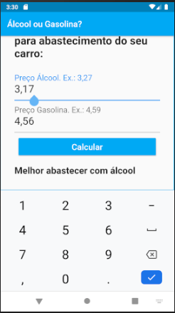
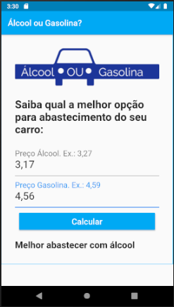

# 04 - APP Gasolina vs Álcool

Mais um app para usar os novos conhecimentos.

## Sobre

É um projeto implementado utilizando Flutter.

App finalizado!

Referências:
- [Flutter.dev](https://flutter.dev/)
- [Udemi: Professor Jamilton Damasceno](https://www.udemy.com/)

Muito mais está por vir...

|||